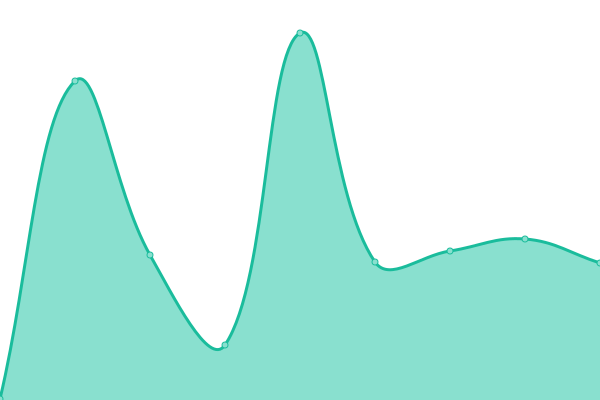

# [📈 Live Status](https://treant-io.github.io/status): <!--live status--> **🟩 All systems operational**

This repository contains the open-source uptime monitor and status page for [Treant](treant.io), powered by [Upptime](https://github.com/upptime/upptime).

With [Upptime](https://upptime.js.org), you can get your own unlimited and free uptime monitor and status page, powered entirely by a GitHub repository. We use [Issues](https://github.com/treant-io/status/issues) as incident reports, [Actions](https://github.com/treant-io/status/actions) as uptime monitors, and [Pages](https://treant-io.github.io/status) for the status page.

<!--start: status pages-->
<!-- This summary is generated by Upptime (https://github.com/upptime/upptime) -->
<!-- Do not edit this manually, your changes will be overwritten -->
<!-- prettier-ignore -->
| URL | Status | History | Response Time | Uptime |
| --- | ------ | ------- | ------------- | ------ |
|  [Zeus](https://gateway.treant.io/health/zeus) | 🟩 Up | [zeus.yml](https://github.com/treant-io/status/commits/HEAD/history/zeus.yml) | 

 1055ms
     
 | 

<a href="https://treant-io.github.io/status/history/zeus">98.98%</a>
    

|  [Ares](https://gateway.treant.io/health/ares) | 🟩 Up | [ares.yml](https://github.com/treant-io/status/commits/HEAD/history/ares.yml) | 

 154ms
     
 | 

<a href="https://treant-io.github.io/status/history/ares">98.94%</a>
    

|  [Consus](https://gateway.treant.io/health/consus) | 🟩 Up | [consus.yml](https://github.com/treant-io/status/commits/HEAD/history/consus.yml) | 

 152ms
     
 | 

<a href="https://treant-io.github.io/status/history/consus">99.01%</a>
    

|  [Aquiles](https://app.treant.io) | 🟩 Up | [aquiles.yml](https://github.com/treant-io/status/commits/HEAD/history/aquiles.yml) | 

 210ms
     
 | 

<a href="https://treant-io.github.io/status/history/aquiles">99.78%</a>
    

<!--end: status pages-->

[**Visit our status website →**](https://treant-io.github.io/status)

## 📄 License

- Powered by: [Upptime](https://github.com/upptime/upptime)
- Code: [MIT](./LICENSE) © [Treant](treant.io)
- Data in the `./history` directory: [Open Database License](https://opendatacommons.org/licenses/odbl/1-0/)
