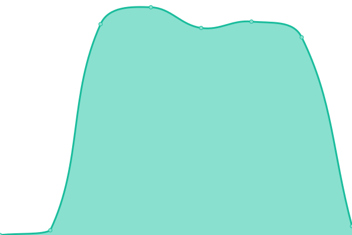

# [📈 Live Status](https://treant-io.github.io/status): <!--live status--> **🟧 Partial outage**

This repository contains the open-source uptime monitor and status page for [Treant](treant.io), powered by [Upptime](https://github.com/upptime/upptime).

With [Upptime](https://upptime.js.org), you can get your own unlimited and free uptime monitor and status page, powered entirely by a GitHub repository. We use [Issues](https://github.com/treant-io/status/issues) as incident reports, [Actions](https://github.com/treant-io/status/actions) as uptime monitors, and [Pages](https://treant-io.github.io/status) for the status page.

<!--start: status pages-->
<!-- This summary is generated by Upptime (https://github.com/upptime/upptime) -->
<!-- Do not edit this manually, your changes will be overwritten -->
<!-- prettier-ignore -->
| URL | Status | History | Response Time | Uptime |
| --- | ------ | ------- | ------------- | ------ |
|  [PROD-Zeus](https://api-prod.treant.io/health/zeus) | 🟩 Up | [prod-zeus.yml](https://github.com/treant-io/status/commits/HEAD/history/prod-zeus.yml) | 

 5710ms
     
 | 

<a href="https://treant-io.github.io/status/history/prod-zeus">100.00%</a>
    

|  [PROD-Ares](https://api-prod.treant.io/health/ares) | 🟩 Up | [prod-ares.yml](https://github.com/treant-io/status/commits/HEAD/history/prod-ares.yml) | 

 8180ms
     
 | 

<a href="https://treant-io.github.io/status/history/prod-ares">100.00%</a>
    

|  [PROD-Consus](https://api-prod.treant.io/health/consus) | 🟩 Up | [prod-consus.yml](https://github.com/treant-io/status/commits/HEAD/history/prod-consus.yml) | 

 6048ms
     
 | 

<a href="https://treant-io.github.io/status/history/prod-consus">100.00%</a>
    

|  [PROD-Aquiles](https://app.treant.io) | 🟩 Up | [prod-aquiles.yml](https://github.com/treant-io/status/commits/HEAD/history/prod-aquiles.yml) | 

 188ms
     
 | 

<a href="https://treant-io.github.io/status/history/prod-aquiles">100.00%</a>
    

|  [Stagging-Zeus](https://apim.treant.io/health/zeus) | 🟥 Down | [stagging-zeus.yml](https://github.com/treant-io/status/commits/HEAD/history/stagging-zeus.yml) | 

 0ms
     
 | 

<a href="https://treant-io.github.io/status/history/stagging-zeus">0.00%</a>
    

|  [Stagging-Ares](https://apim.treant.io/health/ares) | 🟥 Down | [stagging-ares.yml](https://github.com/treant-io/status/commits/HEAD/history/stagging-ares.yml) | 

 0ms
     
 | 

<a href="https://treant-io.github.io/status/history/stagging-ares">0.00%</a>
    

|  [Stagging-Consus](https://apim.treant.io/health/consus) | 🟥 Down | [stagging-consus.yml](https://github.com/treant-io/status/commits/HEAD/history/stagging-consus.yml) | 

 0ms
     
 | 

<a href="https://treant-io.github.io/status/history/stagging-consus">0.00%</a>
    

|  [Stagging-Aquiles](https://aquiles-staging.treant.io) | 🟩 Up | [stagging-aquiles.yml](https://github.com/treant-io/status/commits/HEAD/history/stagging-aquiles.yml) | 

 217ms
     
 | 

<a href="https://treant-io.github.io/status/history/stagging-aquiles">100.00%</a>
    

<!--end: status pages-->

[**Visit our status website →**](https://treant-io.github.io/status)

## 📄 License

- Powered by: [Upptime](https://github.com/upptime/upptime)
- Code: [MIT](./LICENSE) © [Treant](treant.io)
- Data in the `./history` directory: [Open Database License](https://opendatacommons.org/licenses/odbl/1-0/)
